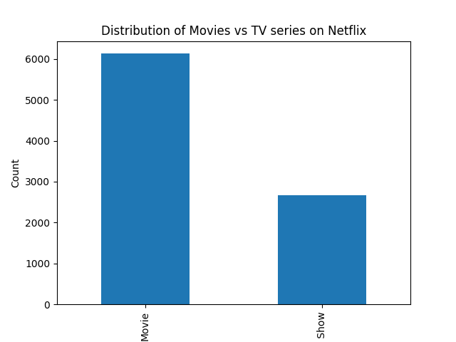
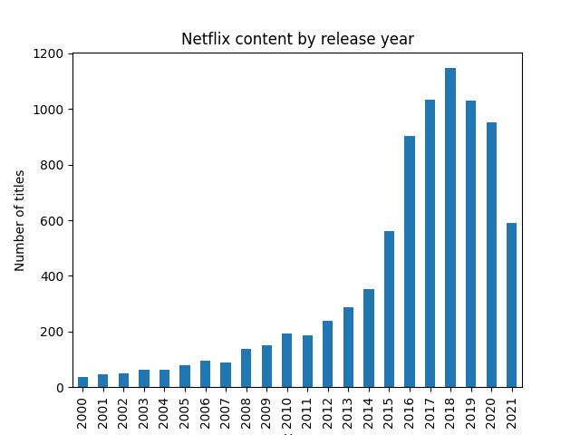
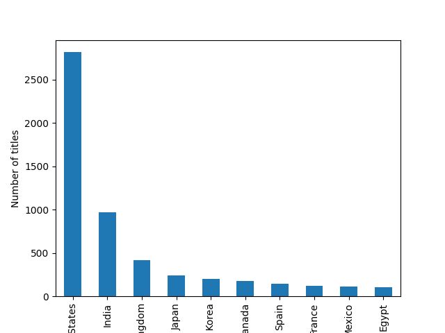

# Netflix Data Analysis
  
## Dataset
Netflix titles dataset from kaggle

## Project Goal
Explore the distribution of netflix content including:
- Movies vs TV Shows
- Release year trends
- Country distribution

## Tools
- Python
- Pandas
- Matplotlib

## Key findings
- Netflix has more movies than TV Shows
- Content increased rapidly after 2015
- The United States dominates the content production

